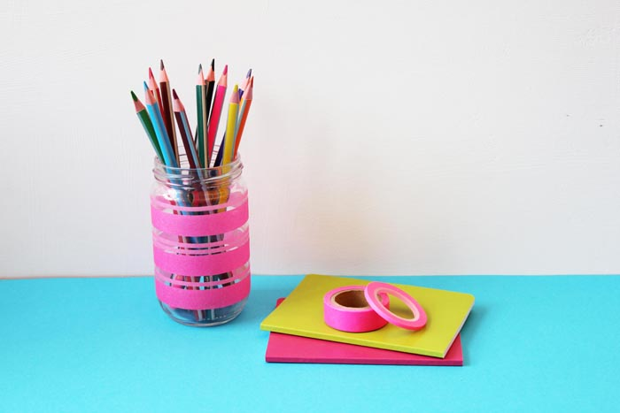
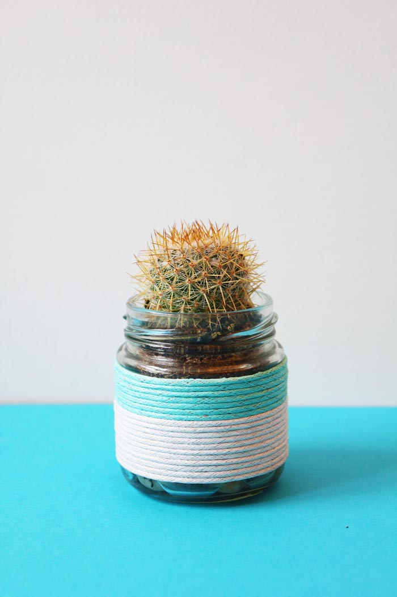
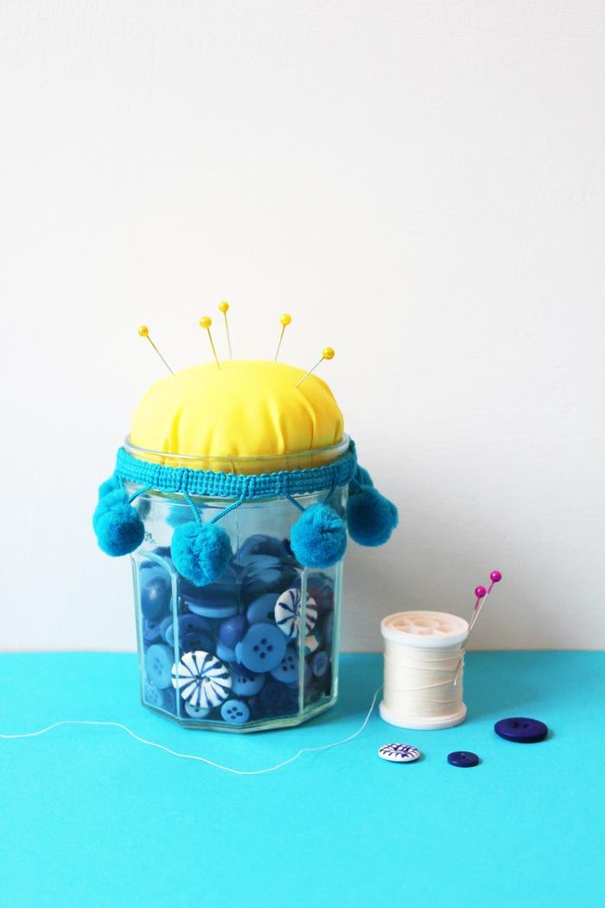
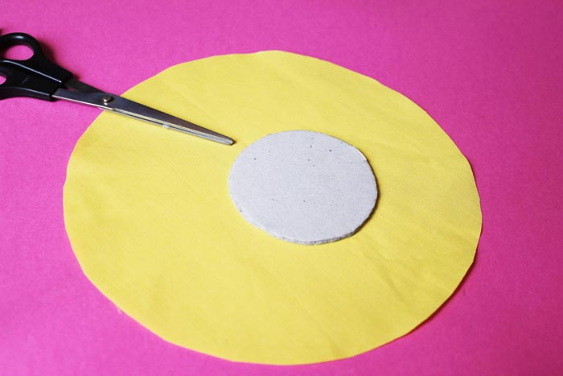
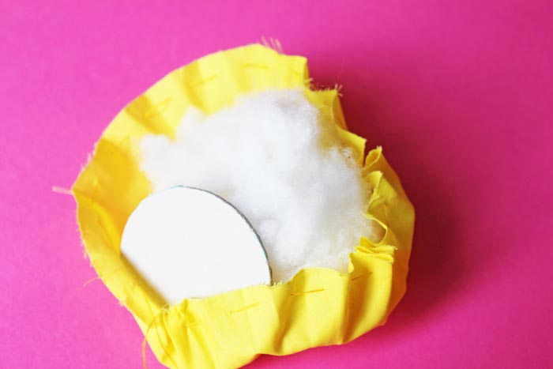
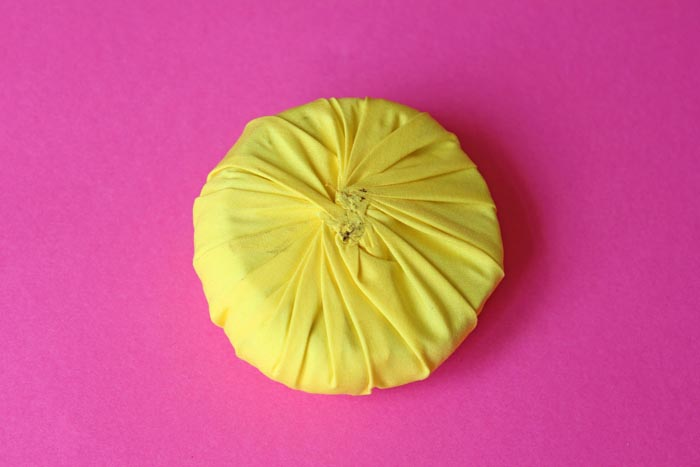
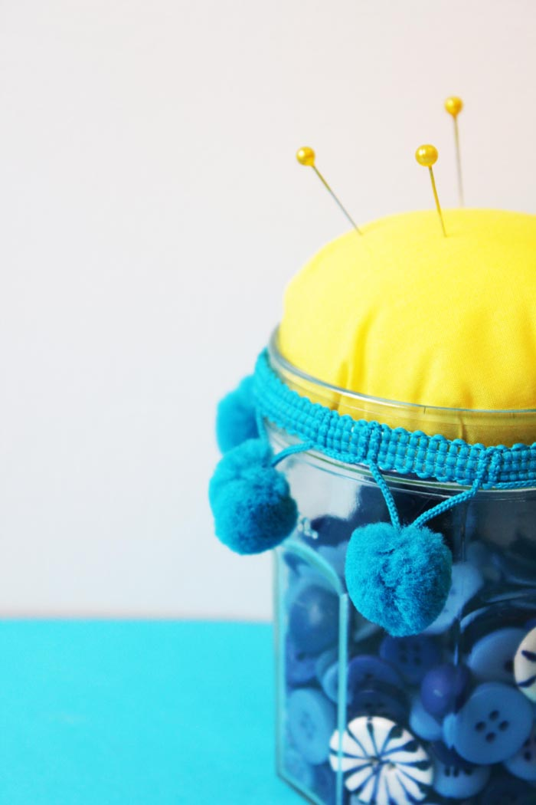
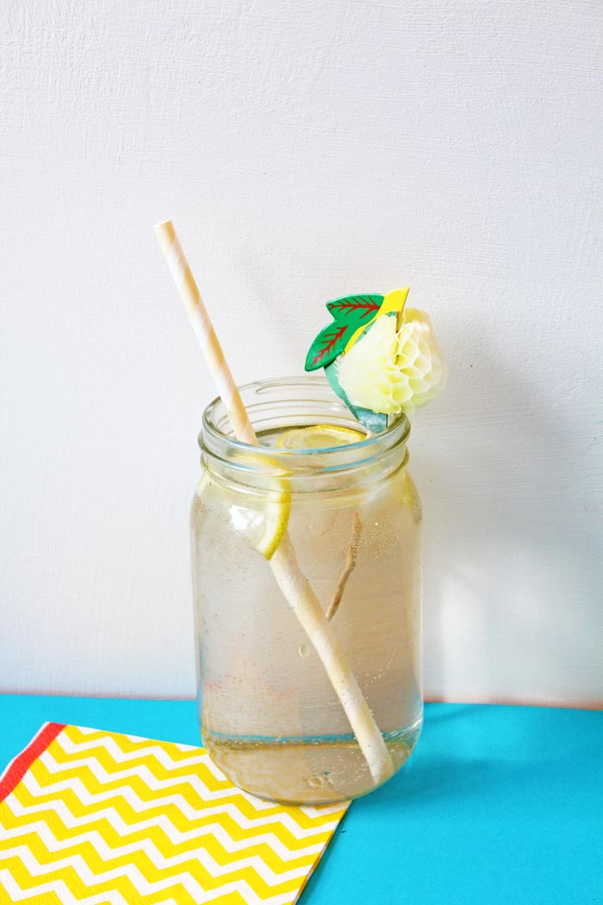

Hello and welcome to my blog! I'm so excited to have you here. I wont ramble on with a long introduction about myself here – I've saved that for the [About Page](http://zabbyallen.com/about/) – head over there if you'd like to know more about me and the sort of things you'll find on my website in future.

For my first post I've decided to feature the humble glass jar. My hoarding habits are not just limited to craft supplies – I see the DIY potential in lots of objects other people would just throw away and so I hoard them away into my magpie's nest for future use! In fact I had collected so many glass jars that I decided one DIY wasn't enough – I needed to bring you 3! Below you will find three different projects, ranging in ability and materials so that hopefully there's something for everyone...

### DIY WASHI TAPE PENCIL POT

| You Will Need                   |
| ------------------------------- |
| Clean glass jar, labels removed |
| Washi tape of your choice       |
| Scissors                        |
| Ruler                           |

You Will Need:
- Clean glass jar, labels removed
- Washi tape of your choice
- Scissors
- Ruler

This DIY is super-duper easy and uses one of my favourite things – washi tape! The hardest part is deciding which washi tape you want to use... I went with thick and thin neon pink MT tape from [Fox & Star](http://www.thefoxandstar.co.uk/).

All you need to do is wrap strips of tape around the jar, trying to keep it as straight as possible. The jar I used had a ridge around the top which helped to keep the first strip nice and straight. You can use a ruler to help you with the rest but don't worry too much – the beauty of washi tape is that you can pull it back up and re-stick without doing any damage!

I've been using mine as a pencil pot but it would look great as a vase too!

### DIY CORD-WRAPPED PLANTER JAR

You will need:

- Small clean glass jar, labels removed
- Double sided tape
- Cord or twine
- Scissors
- A dab of PVA glue

I've become pretty addicted to collecting cacti and succulents – especially mini ones as I don't have a lot of space in my house (I think you're getting the gist now – I own *a lot* of stuff!). This means that I need a lot of planters too, and this DIY cord-wrapped one is really easy to recreate.

Start by wrapping double sided tape all the way around your jar. Again, I used a jar with a ridge at the top and bottom to make it easier. Try not to leave any gaps in between the strips of tape and keep the backing paper on for as long as possible.

Once your jar is covered in tape, remove the backing paper from the top strip and start wrapping cord all the way around your jar, keeping the cord as closely packed as possible. Remove the backing paper as you go and once you get about a third of the way down this is the time to change colour (if you want to!). Simply snip your cord at the back of the jar (underneath your starting point) and start fresh with a new colour from where you left off. Once you get to the end, snip off the cord and secure the end with a tiny dot of glue if you need to.

Then all you need to do is find a fancy cactus or succulent to pop into your new planter! This would also be a great DIY to do with all of that bakers twine you've been saving up from your [Lucky Dip Club](http://luckydipclub.com/) boxes and other cute packages (everyone else does that too right?..).

### DIY PINCUSHION SEWING JAR

You will need:

- Clean glass jar, labels removed
- Pom Pom trim
- Cardboard
- Stuffing or cotton wool
- Scissors
- Fabric
- Needle and Thread
- Glue gun

This DIY is a little trickier than the other two but still not very hard and does two jobs in one – storage and pincushion!

Start by making a cardboard template using your jar (lid removed). Draw around the top of the jar and then cut inside the line you've drawn so that it slots inside the jar comfortably, allowing a little extra room for the fabric that will be wrapped around it.

Next cut a circle of fabric larger than the circle (I drew around a small plate) and then sew a wide running stitch all the way around the outside, about 1cm in from edge. Take a handful of stuffing and place it in the centre of the fabric circle. Pull the thread that you've just sewn so that it gathers around the stuffing and then place the cardboard circle on top before knotting it tightly. I had my iron to hand so I gave it a quick press just to flatten it down a bit.

The last step is just to stick the pom pom trim around the rim of the jar with a glue gun, fill with buttons or ribbon or whatever your heart desires and pop the pincushion on top as a lid.

### GET YOUR DRINK ON

Finally of course the other thing you could do with a glass jar is fill it with a cocktail!

Here are a couple of my favourite recipes:

### GIN & MINT
Serves 1

- 50ml gin
- Two sprigs fresh mint, washed
- 1cm thick slice fresh cucumber, quartered
- 100ml chilled elderflower pressé (not concentrate)
- Small mint sprig and thin lemon slice to garnish

Place the gin, mint and cucumber in the bottom of a cocktail shaker or glass jug, and stir for a minute, squashing down the mint and cucumber with the back of a spoon or muddler to bruise them and release their juices. Strain into a jar filled with a couple of ice cubes, and top up with elderflower pressé. Garnish with mint and lemon and add a fun paper straw!

### MANGO COLADA
Serves 2

- 125ml unsweetened mango juice or nectar
- 100g ripe mango cubes, fresh or frozen
- 125g crushed ice (or 60g if using frozen mango)
- 60ml cream of coconut, coconut milk, or coconut water
- Juice of half a lime
- 60ml white rum

Combine all ingredients in a blender and blend until smooth and thick. Serve in a large jar, garnished with a slice of pineapple and a fancy umbrella!

Find more on my [Drinks board](https://www.pinterest.com/zallen/drink-alcoholic/) on [Pinterest](https://www.pinterest.com/zallen/).

I hope you enjoyed my first DIY post. I'd love to see the results if you try any of these DIY projects (or drinks recipes!) so don't forget to tag me in on [instagram](https://instagram.com/zabbyallen/) or [twitter](https://twitter.com/zabbyallen) @zabbyallen

Next I'll be sharing some free and fruity desktop backgrounds so look out for that!

