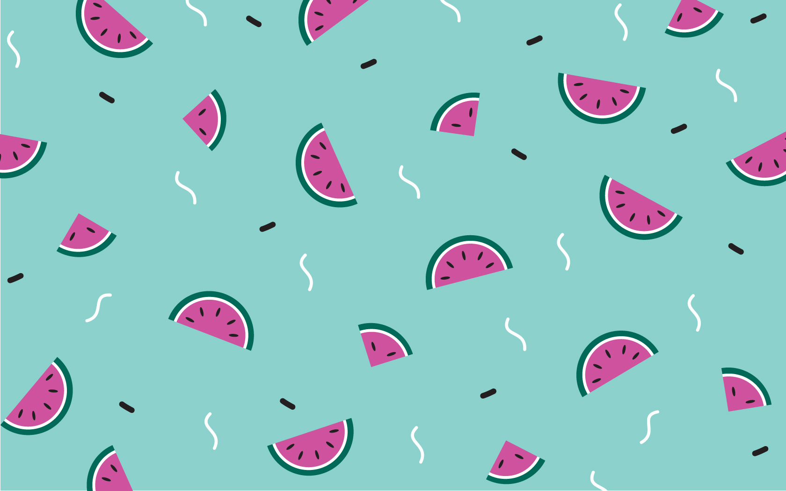
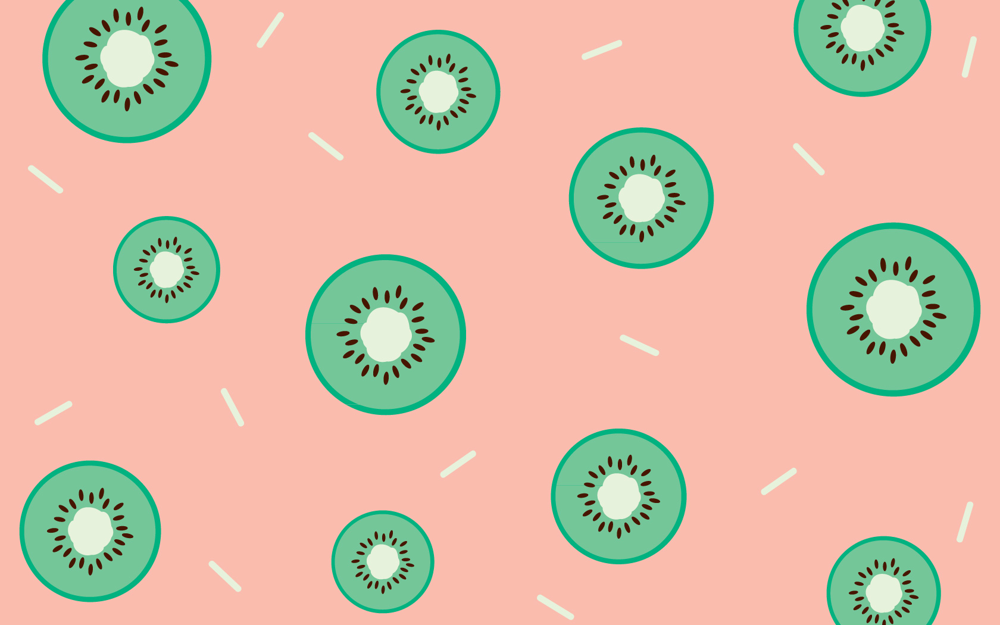
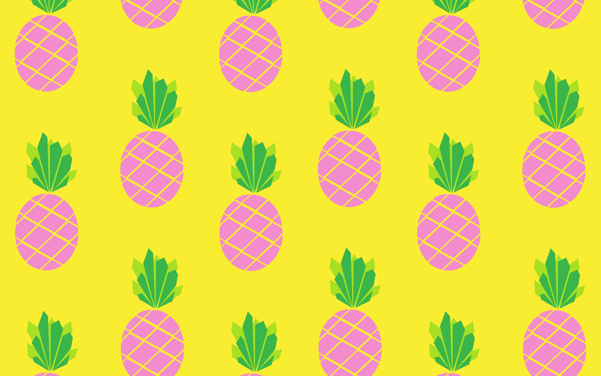

<!-- added the proper grav/markdown header in as an example, but you should be able to set all this through the admin GUI when you're creating posts on your own so no worries -->

Happy Friday! To celebrate the end of the (official) working week I'll be sharing a freebie once a month. This month I'm sharing some free and fruity desktop backgrounds and phone wallpapers. Just because winter is getting closer it doesn't mean our screens can't remain tropical! So enjoy these free watermelon, kiwi and (pink!) pineapple backgrounds which are available to download in several sizes below. The link will take you to flickr where you can download the original sizes and a few others too!

If you can't find a size that's right for your device please email me at zabbyallen@gmail.com so that I can add another option for you! 

Large should be suitable for large desktop screens such as iMacs, Medium should suit laptops such as MacBook Pros and Small should fit small portable laptops such as MacBook Air. 

<!-- added inline links to social media pages (btw whatever youre using to repost to twitter from isnta is cutting off your posts at 137chars with no way to see the full thing)
-->

I'd love to see them in action – so if you share a photo please remember to tag me in on [Instagram](http://instagram.com/zabbyallen) or [Twitter](http://twitter.com/zabbyallen) @zabbyallen. Have a great weekend team!  

## WATERMELON

<!-- you were missing file extensions on the links to local images, added in .jpg on each -->

<!--
your image files were also inconsistently named, had some spaces in the place of dashes.

best practice:
a) never have any spaces in file names, only - or _ & all lowercase
b) keep it simple: za-watermelon-1680.jpg etc
-->
[Large 2560 x 1440](http://i.imgur.com/MSt5GbN.jpg) | [Medium 1680 x 1050](http://i.imgur.com/ky1qOUN.jpg) | [Small 1440x900](http://i.imgur.com/LfazJUR.jpg) | [iPad and Tablet 1024 x 1024](http://i.imgur.com/yXM1oxL.jpg) | [Smartphone 640x1136](http://i.imgur.com/blztZh3.jpg)

## KIWI

[Large 2560 x 1440](http://i.imgur.com/0vHRPF2.jpg) | [Medium 1680 x 1050](http://i.imgur.com/WxDwcfq.jpg) | [Small 1440x900](http://i.imgur.com/ctQYxpu.jpg) | [iPad and Tablet 1024 x 1024](http://i.imgur.com/q1L7XE6.jpg) | [Smartphone 640x1136](http://i.imgur.com/A5hDGZM.jpg)

## PINEAPPLE

[Large 2560 x 1440](http://i.imgur.com/YgWP6t5.jpg) | [Medium 1680 x 1050](http://i.imgur.com/3oV3Ais.jpg) | [Small 1440x900](http://i.imgur.com/VeeURCU.jpg) | [iPad and Tablet 1024 x 1024](http://i.imgur.com/5EQFYuT.jpg) | [Smartphone 640x1136](http://i.imgur.com/GfZZjZi.jpg)

Enjoy! 

