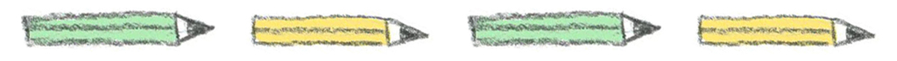

I’m a freelance designer from London with a love of bright colours and all things crafty. Check our my online shop to see what I’ve been creating lately. Most of my prints and products aim to raise money for various charities. Creativity runs through all that I do, when I’m not creating my own work I am an illustrator’s agent for [Phosphor Art](http://www.phosphorart.com/), helping artists around the world land their dream commissions. I’m also the editor of Girl Planet, a small publication which encourages creativity and celebrates kick-ass girls around the world - it goes out to over 1000 subscribers every month in [Lucky Dip Club](http://www.luckydipclub.com) boxes. 

Interested in collaborating or commissioning something? [Get in touch!](/contact) 

​ 

_Disclaimer: Unless otherwise stated all images belong to me and I will do my best to credit all outsourced images and link back to the original source. Please remember to credit me if you'd like to share my images and I'll do the same for you!_ 